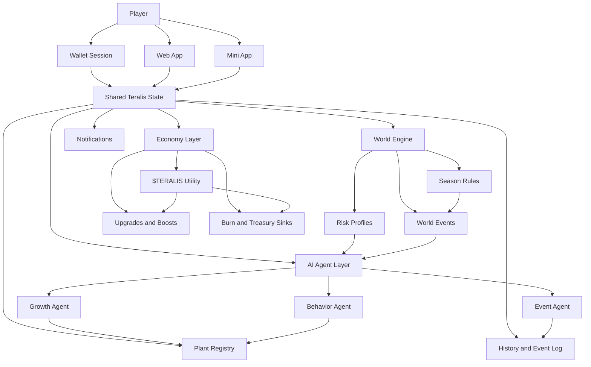

<p align="center">
  
</p>

<h1 align="center">Teralis AI</h1>

<div align="center">
  <p><strong>AI-driven on-chain plant simulation where every organism evolves through worlds, events, and player decisions</strong></p>
  <p>
    Digital plants • AI agents • Dynamic worlds • Seasonal progression • $TERALIS utility
  </p>
</div>

---

## 🚀 Quick Links

[](https://your-web-app-link)
[](https://t.me/your_mini_app)
[](https://your-docs-link)
[](https://x.com/your_account)
[](https://t.me/your_group_or_channel)

> [!IMPORTANT]
> Teralis AI is built around living digital plants, not static collectibles. Each plant develops through AI decisions, world conditions, and player actions over time.

## One-Line Value

Teralis AI gives players a living on-chain simulation where digital plants evolve through AI-driven growth, shifting risk environments, and meaningful long-term progression powered by $TERALIS.

## Why It Wins

Most on-chain game loops reduce assets to passive holding, repetitive staking, or simple number growth. Teralis AI is designed around persistence, adaptation, and branching outcomes. Every plant carries its own timeline, reacts differently under pressure, and develops through shared control between player intent and AI autonomy.

| What usually happens | What Teralis AI does instead |
|---|---|
| Static asset ownership | Persistent organisms with evolving histories |
| Linear upgrades | Branching growth, setbacks, and trait divergence |
| One fixed environment | Multiple worlds with different risk/reward profiles |
| Simple click-to-earn loop | AI-mediated decisions with strategic consequences |
| Token as pure speculation | Token as utility for progression, access, and sinks |

> [!TIP]
> Teralis works best when players think in probabilities, not guaranteed outcomes. Good decisions improve direction and resilience, but they do not hard-script the result.

### What becomes faster or easier

Instead of micromanaging every tiny parameter, players work at the level of strategy:
- choose a world
- shape risk exposure
- respond to events
- guide a plant toward growth, resilience, or rare trait paths

That makes the experience easier to learn than a deep management sim, while still leaving room for optimization and discovery.

### Why it beats the usual approach

Teralis AI creates tension between **control** and **autonomy**. You choose the direction. AI fills in the living behavior. That balance makes each plant feel less like a token slot and more like an evolving system you are trying to understand, protect, and push forward.

## Product View

Teralis AI is one persistent simulation layer with several ways to access it. Plants, worlds, seasons, actions, and token flows all connect to the same core state.



## See It Work

Below is a simple example of the gameplay loop in practice.

### Example input → outcome

| Step | Player input | System response |
|---|---|---|
| 1 | Create a resilient starter plant in a stable world | Plant is minted with initial stats and base traits |
| 2 | Use **Nurture** for several cycles | Growth rises steadily, risk remains low |
| 3 | Move into a higher-risk world | Event intensity increases and progression paths widen |
| 4 | Choose **Challenge** during a volatile phase | AI evaluates health, world pressure, and history |
| 5 | A drought event triggers | Plant loses some health but unlocks a drought-resistant trait |
| 6 | Spend $TERALIS on protection boost | Future negative shocks become easier to survive |

> [!NOTE]
> Similar seeds can diverge into very different outcomes because growth is influenced by world conditions, AI interpretation, and prior history.

## Run in 60 Seconds

Teralis AI is primarily experienced through the web app and mini-app flow rather than a local package install. The fastest way to get started is to connect a wallet, create a first plant, and trigger the first action cycle.

### Quick start

1. Open the Teralis AI web app  
2. Connect your non-custodial wallet  
3. Create your first plant in a starter world  
4. Review its initial stats and traits  
5. Trigger a first action such as **Nurture** or **Protect**  
6. Watch the event log and growth response update

### Expected result

After the first session, you should have:
- a wallet-linked Teralis account
- one active plant with a visible state
- a world assignment
- a basic event history
- access to the core progression loop

> [!WARNING]
> Any token-based action should be reviewed in your wallet before signing. Teralis AI never asks for seed phrases or private keys.

## Use It Your Way

Teralis AI supports different interaction styles depending on session length and player intent.

| Surface | Best use | What it is for |
|---|---|---|
| Web App | Full sessions | Plant management, world selection, upgrades, economy, history |
| Mini App | Fast check-ins | Quick actions, event review, time-sensitive reactions |
| Wallet-linked identity | Secure access | Non-custodial sign-in and transaction approval |
| Future integrations | Extended ecosystem | Notifications, progression layers, community features |

The web app is the full control surface. The mini-app is the lightweight loop for short sessions, quick decisions, and timely reactions.

## Core Examples

These examples are written as conceptual interaction patterns for documentation and integration planning.

### 1. Create a new plant

```ts
const plant = await teralis.plants.create({
  worldId: "starter-world",
  seedType: "resilient",
  wallet: userWalletAddress
})
```

### 2. Trigger a plant action

```ts
const result = await teralis.plants.act({
  plantId: "plant_1042",
  action: "nurture"
})
```

### 3. Move a plant into a higher-risk world

```ts
const move = await teralis.worlds.assignPlant({
  plantId: "plant_1042",
  worldId: "volatile-biome"
})
```

### 4. Spend $TERALIS on a protection boost

```ts
const upgrade = await teralis.economy.applyBoost({
  plantId: "plant_1042",
  boost: "protective-shell",
  token: "TERALIS"
})
```

> [!IMPORTANT]
> These examples are for illustrating product flow and README structure. Exact endpoints, SDK methods, and payloads should match the production implementation.

## How It Works

Teralis AI combines simulation design, AI-driven behavior, and token utility into one continuous loop.

### Internal flow

1. A player connects a wallet and creates or opens a plant  
2. The plant exists inside a selected world with its own rules and event profile  
3. The player chooses an action such as nurture, challenge, protect, or wait  
4. AI agents evaluate plant stats, world conditions, and recent history  
5. The system updates growth, health, traits, and event outcomes  
6. If applicable, $TERALIS is earned, spent, burned, or routed to treasury  
7. The plant history expands, affecting future behavior and strategic choices

### Core system layers

| Layer | Function |
|---|---|
| Plant layer | Stores state, traits, stages, and progression |
| World layer | Defines environmental risk, pacing, and event intensity |
| Agent layer | Drives growth, event outcomes, and behavioral variation |
| Economy layer | Connects creation, upgrades, access, and sinks through $TERALIS |
| History layer | Tracks prior actions and outcomes that influence future paths |

This structure is what makes Teralis feel alive. The plant is never isolated from its context. Its growth is always interpreted through where it lives, what has happened before, and how aggressively the player is shaping its path.

## What You Can Change

Teralis AI has room for extension without breaking the core loop.

### Adjustable surfaces

- world rules and risk levels
- event intensity and frequency
- seasonal modifiers
- plant archetypes and starting traits
- upgrade design and progression cost
- token sinks and reward balance
- mobile notification logic
- cosmetic layers and visual evolutions

### Design philosophy

The goal is not infinite customization for its own sake. The goal is to keep the simulation legible while allowing enough variation for distinct worlds, new seasons, and deeper strategic experimentation.

> [!NOTE]
> The best extensions are the ones that create new decision spaces without turning the system into noise.

## Limits & Trade-Offs

Teralis AI is stronger as a living simulation than as a deterministic game. That creates real advantages, but also honest trade-offs.

| Strength | Trade-off |
|---|---|
| Emergent behavior feels alive | Outcomes are less predictable |
| Shared control creates depth | Some players may want more direct control |
| Multi-world design increases variety | More systems require clearer onboarding |
| Token utility adds progression depth | Economy balance must be handled carefully |
| Long-term plant history is meaningful | Fast-reward users may find it slower than arcade loops |

### Non-goals

Teralis AI is not trying to be:
- a passive staking shell
- a guaranteed yield product
- a click-to-win progression farm
- a fully deterministic management sim
- a token wrapper without gameplay depth

> [!CAUTION]
> AI-driven systems can produce surprising outcomes. Similar setups do not guarantee identical results, especially across different worlds, seasons, or event histories.

## Best For / Not For

### Best for

Teralis AI is built for players who enjoy:
- simulation and progression systems
- long-term collection with unique histories
- experimenting with risk and environment design
- AI-mediated gameplay loops
- utility-driven token economies tied to actual use

### Not for

It is not ideal for users who want:
- instant guaranteed rewards
- fixed linear outcomes
- pure speculation without gameplay
- zero-risk token interaction
- a totally passive experience

## Security Model

Teralis AI uses a non-custodial model from the ground up.

| Principle | Meaning |
|---|---|
| Wallet ownership | Users keep full control of keys and assets |
| Read access | The app reads public on-chain data for gameplay and account linking |
| Write access | Any token spend or state-changing action requires explicit wallet signature |
| No custody | Teralis cannot move funds without user approval |
| Disconnect freedom | Users can disconnect the wallet at any time |

> [!IMPORTANT]
> Always verify the domain, review transaction prompts carefully, and never share recovery phrases with anyone.

## Economy Snapshot

$TERALIS functions as utility, progression fuel, and an economic balancing tool inside the simulation.

| Category | Role in Teralis AI |
|---|---|
| Creation | Minting plants and expanding plant capacity |
| Access | Unlocking worlds, scenarios, events, or premium layers |
| Upgrades | Applying boosts, trait upgrades, and progression tools |
| Seasons | Entering special cycles and reward tracks |
| Sinks | Burn mechanics, treasury routing, and event costs |

A typical design direction may use a split such as **80% burn / 20% treasury** on relevant in-game spend, with on-chain tracking for transparency.

## Final Perspective

Teralis AI is built around one core belief: digital life becomes more interesting when it grows through tension, adaptation, and incomplete control.

That is why the product centers on:
- persistent plants instead of disposable assets
- worlds instead of flat menus
- AI interpretation instead of static scripting
- utility-driven progression instead of idle holding

If the system is balanced well, Teralis AI becomes more than a game loop. It becomes a long-form simulation where players shape living outcomes over time.

---

## Risks & Disclaimers

> [!WARNING]
> Teralis AI is an experimental simulation product. It does not provide financial, legal, or investment advice.

> [!CAUTION]
> $TERALIS may be volatile, illiquid, or lose substantial value. Participation in any token-based ecosystem carries risk.

> [!NOTE]
> Gameplay systems, AI behaviors, world rules, and economy parameters may evolve over time as the project develops.

> [!IMPORTANT]
> Users are responsible for wallet security, jurisdictional compliance, and reviewing every transaction before approval.
